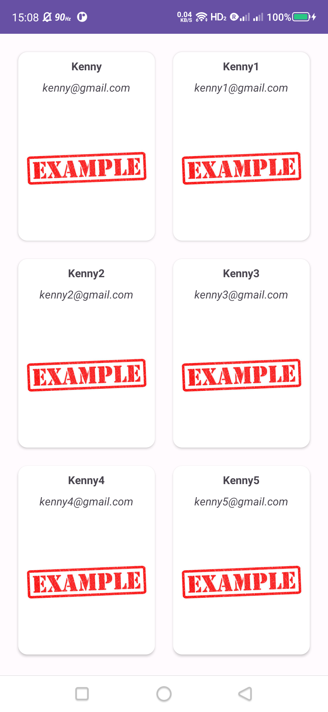

# JavaRecycleViewExample
### The Java RecyclerView Example demonstrates the power and flexibility of the RecyclerView widget in Android development. Leveraging the efficiency of RecyclerView, this example provides a streamlined approach to displaying and managing large sets of data in a dynamic and resource-efficient manner.

